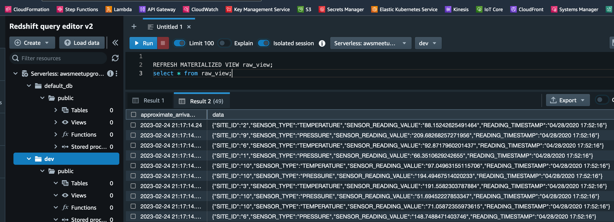

# AWS Meetup Group

## AWS Data Pipeline - Part 2
Usage example of some more commonly used AWS data services:
 * Glue
 * Redshift
 * Elasticsearch
 * Athena, again!

### Part 2 Links n Such:
 * Live stream: https://youtu.be/r9xcVWTNV6c
 * Slides: https://speakerdeck.com/kevasync/aws-data-pipeline-part-2


## AWS Data Pipeline - Part 1
Usage example of some commonly used AWS data services:
 * Kinesis Data Streams
 * Kinesis Firehose Delivery Stream
 * Kinesis Analytics Applications
 * S3
 * Athena

### Part 1 Links n Such:
 * Live stream: https://youtu.be/Nm_GWcHgsno
 * Slides: https://speakerdeck.com/kevasync/aws-data-pipelines-part-1


## Getting Started
Prerequisites:
 * Active AWS account w/ [CLI access configured](https://docs.aws.amazon.com/cli/latest/userguide/cli-chap-configure.html)
 * Active Pulumi account (Can be created using GitHub as login provider)
 * [Pulumi CLI](https://www.pulumi.com/docs/get-started/install/)
 * [.NET Core](https://dotnet.microsoft.com/en-us/download/dotnet/3.1)
    * If having issues on Mac, try `dotnet-install.sh` script outlined [here](https://danielhilton.medium.com/how-to-install-multiple-asp-net-core-runtimes-in-macos-717e8d0176ea)

Install Pulumi and deploy:
 * `cd iac`
 * `pulumi login`
 * Set region: `pulumi config set aws:region <value>`
    * Replacing `<value>` with your preferred region
 * `pulumi up`
    * Follow prompts to create a new stack (Or select existing stack if already created)
    *  Name stack `<org>/data-pipeline`
        * Replacing `<org>` with your Pulumi organization name
        * This will be your GitHub user ID if you used it as auth provider
   * Accept prompt to deploy resources. The first deployment will take several minutes:
      ```bash 
      pulumi up
      Previewing update (data-pipeline)

      View Live: https://app.pulumi.com/kevasync/aws-meetup-group-data-services-infra/data-pipeline/previews/d494efb2-6d02-439f-86ef-e5467ced8ef1

         Type                                   Name                                                                         Plan       
      +   pulumi:pulumi:Stack                    aws-meetup-group-data-services-infra-data-pipeline                           create     
      ...   
      +   └─ aws:kinesis:FirehoseDeliveryStream  AWSMeetupGroup_DataServicesDemo_temperature_producer_es                      create     


      Outputs:
         EnrichedPressureBucketName   : "awsmeetupgroup-dataservicesdemo-pressure-enriched-data-1f16ea5"
         ...
         StreamName                   : "aws-meetup-group.iot.sensor-readings.incoming-b58a357"

      Resources:
         + 50 to create

      Do you want to perform this update? yes
      Updating (data-pipeline)

      View Live: https://app.pulumi.com/kevasync/aws-meetup-group-data-services-infra/data-pipeline/updates/1

         Type                                   Name                                                                         Status              Info
      +   pulumi:pulumi:Stack                    aws-meetup-group-data-services-infra-data-pipeline                           creating (135s)     'dotnet build -nologo .' completed successfully
      +   ├─ aws:glue:CatalogDatabase            AWSMeetupGroup_DataServicesDemo_glue_schema_database                         created (1s)        
      ...
      +   ├─ aws:kinesis:Stream                  aws-meetup-group.pressure.enirched                                           created (23s)       
      ```
   * _Note:_ you may see error waiting for Redshift Serverless Workgroup to become available:
      ```bash
      aws:redshiftserverless:Workgroup (awsmeetupgroup-dataservicesdemo-redshift-workgroup):
      error: 1 error occurred:
         * creating urn:pulumi:data-pipeline::aws-meetup-group-data-services-infra::aws:redshiftserverless/workgroup:Workgroup::awsmeetupgroup-dataservicesdemo-redshift-workgroup: 1 error occurred:
         * waiting for Redshift Serverless Workgroup (awsmeetupgroup-dataservicesdemo-redshift-workgroup) to be created: timeout while waiting for state to become 'AVAILABLE' (last state: 'CREATING', timeout: 10m0s)
      ```
      * Run `pulumi up -y` again if so
   

Setup Redshift Stream Ingestion

* Using RedshiftRoleArn from Pulumi output, navigate to Redshift Query Editor for newly created workgroup and execute query to create external schema for Kinesis:
   ```sql
   CREATE EXTERNAL SCHEMA kds
      FROM KINESIS
      IAM_ROLE 'yourRoleArn';
   ```
* Create Materialized views for raw and enriched Kinesis Streams (Find stream names in `IncomingStreamName`, `EnrichedPressureStreamName`, and `EnrichedTemperatureStreamName` Pulumi stack outputs)
   ```sql
   CREATE MATERIALIZED VIEW raw_view AUTO REFRESH YES AS
      SELECT 
         approximate_arrival_timestamp,
         JSON_PARSE(kinesis_data) as Data
      FROM kds."yourIncomingStreamName"
      WHERE CAN_JSON_PARSE(kinesis_data);

   CREATE MATERIALIZED VIEW pressure_view AUTO REFRESH YES AS
      SELECT 
         approximate_arrival_timestamp,
         JSON_PARSE(kinesis_data) as Data
      FROM kds."yourEnrichedPressureStreamName"
      WHERE CAN_JSON_PARSE(kinesis_data);

   CREATE MATERIALIZED VIEW temperature_view AUTO REFRESH YES AS
      SELECT 
         approximate_arrival_timestamp,
         JSON_PARSE(kinesis_data) as Data
      FROM kds."yourEnrichedTemperatureStreamName"
      WHERE CAN_JSON_PARSE(kinesis_data);
   ```
   * _Note:_ stream names are enclosed in _double-quotes_ as hyphens in names are not valid otherwise
   * To test, set `STREAM_NAME` environment variable using `IncomingStreamName` output and run [sample data producer](./kinesis-producer/produce.py)
      * Let run for a few seconds and hit `ctrl-c` to exit
   * Back in the Redshift Query Editor, execute the following to view data from topic:
      ```sql
      REFRESH MATERIALIZED VIEW raw_view;
      select * from raw_view;
      ```
      
   
Setup Analytics Applications
* Todo

Setup Athena Tables
* Todo